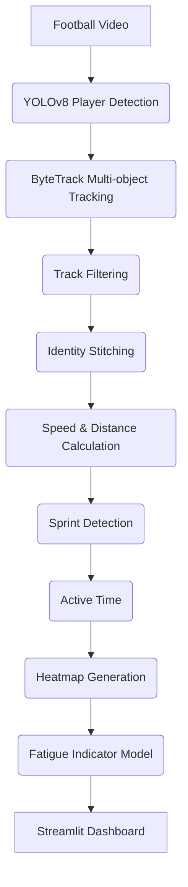

# ⚽ Football Video Analysis Platform
## Player Tracking, Performance Analytics & Fatigue Indicators

A computer vision pipeline that processes broadcast football footage and extracts player-level performance intelligence including:

- Player detection and tracking
- Movement estimation
- Distance covered
- Speed profiles
- Sprint detection
- Active time analysis
- Pitch heatmaps
- Fatigue indicators
- Interactive performance dashboard

The system processes a full football match through an offline analytics pipeline and presents results through a Streamlit dashboard.

---
# System Architecture

### Folder Structure

```text
Mitus_INT/
├── 1st_Half/              # Data, logs, or models for the first half analysis
├── 2nd_Half/              # Data, logs, or models for the second half analysis
├── football footage/      # Raw video files
├── .gitignore
├── app.py                 # Core Streamlit application entry point
├── requirements.txt       # Project python dependencies
└── README.md              # Project documentation
```


Generated JSON outputs are excluded from version control due to file size.

To reproduce results, run the pipeline scripts in order as described below.

---

# Installation

Clone repository:

```bash
git clone <repository-url>
cd Mitus_INT
```
Create virtual environment:
```
python -m venv Mvenv
```
Activate: 
```
Mvenv\Scripts\activate
```
Install Dependencies : 
```
pip install -r requirements.txt
```

## Pipeline Execution

### 1. Player Detection and Tracking
**YOLOv8** is utilized for person detection, while **ByteTrack** maintains consistent object identities across frames.
* **Output:** `tracks.json`

### 2. Track Filtering
* **Purpose:** 
  * Remove short-lived, unstable detections.
  * Reduce false positives caused by the crowd or stadium background.
* **Output:** `tracks_filtered.json`

> 💡 **Threshold Note:** A moderate minimum track duration was selected. Increasing this threshold successfully reduces false detections, but it also accidentally removes valid players during broadcast camera cuts or ID fragmentation.

### 3. Identity Stitching
Broadcast football footage inherently introduces challenges like camera cuts, rapid zoom changes, and temporary player disappearance. To resolve this, a lightweight spatial-temporal stitching method was implemented to merge likely continuation tracks.
* **Output:** `tracks_stitched.json`
* **Limitation:** Identity stitching drastically improves continuity but does not guarantee confirmed, absolute player identity. Final analytics are therefore reported at the **tracked-entity level**.

### 4. Pitch Coordinate Transformation
Player locations are converted from 2D image coordinates into approximate 2D pitch coordinates. A **homography-based transformation** reduces camera perspective distortion, which enables:
* Real-time movement trails
* Positional heatmaps
* Accurate distance estimation

### 5. Speed and Distance Calculation
Movement between consecutive frame observations is converted into approximate real-world meters.

* **Distance Formula:**
  ```math
  \(\text{distance} = \sqrt{(x_2 - x_1)^2 + (y_2 - y_1)^2} \%\%\)MAGIT_PARSER_PROTECT%%  ```
* **Speed Formula:**
  ```math
  \(\text{speed} = \frac{\text{distance}}{\text{time}} \%\%\)MAGIT_PARSER_PROTECT%%  ```

⚠️ **Main Sources of Error:** Broadcast camera panning/zooming, incomplete pitch visibility, imperfect tracking continuity, and approximate calibration.

---

## Fatigue Indicator Model

### Motivation
Fatigue develops over long periods through accumulated workload. While the ideal approach compares player intensity across the entire match, broadcast tracking creates fragmented player trajectories. 

Therefore, the implemented model evaluates the **observed intensity decline** specifically within each player's available tracking timeline.

### Method
For each tracked player, the pipeline executes the following steps:
1. Sort observations chronologically.
2. Split observations into two equal time sections.
3. Calculate average speed for both windows: **Early Intensity** vs. **Late Intensity**.
4. Compute the **Intensity Drop %**:

* **Flagging:** Players exceeding a **20% decline threshold** receive an elevated intensity-drop flag.

### Important Limitation
While the fatigue method is structurally correct, tracking continuity limits long-term interpretation. The best-tracked players currently only have short, continuous windows of observation. 
* The model effectively demonstrates the **fatigue detection mechanism**.
* It should **not** be interpreted as true physiological fatigue accumulated over a full 90-minute match.
* The bottleneck is **player identity continuity**, not the math itself. With longer continuous tracking, this identical methodology will provide meaningful match-level fatigue analysis.

---

## Performance Metrics

The Streamlit dashboard breaks metrics down into two distinct views:

### Team Overview
* Total number of tracked players
* Overall distance rankings
* Team-wide speed statistics
* High-intensity sprint counts
* Fatigue indicator distribution

### Player View
* Total distance covered
* Average speed & peak speed
* Total sprint count
* Total active time
* Speed-over-time telemetry graph
* Dynamic pitch heatmap
* Individual fatigue indicator status

---

## Results

The analytical pipeline was successfully executed on both halves of the match, yielding the following metrics:

### ⚽ First Half
* **73** tracked entities identified.
* **35** players evaluated for fatigue tracking.
* **12** observed intensity decline flags triggered.
* Player heatmaps successfully generated.

### ⚽ Second Half
* **110** tracked entities identified.
* **52** players evaluated for fatigue tracking.
* **18** observed intensity decline flags triggered.
* Player heatmaps successfully generated.


## The Whys
1. ***How did you get a full match to process in reasonable time? What did you trade off?*** Firstly, i sourced the match tape from SoccerNet and they had some libraries like SoccerNetDownloader which really helped in the downloading and processing of the video. Now the actual processing and detection on the actual video was done using Yolo (Ultralytics) and byte track bundled in a library which made the processing, detection and tracking seemless. To be that seemless and less time consuming i traded speed for quality (i downloaded the lowest resolution of the footage), detection precisio ( i used Yolov8n which is the lighest and fastest but least efficient). Also, i had to switch from running on CPU to GPU, i wouldn't really call this a trade off more like an upgrade (my laptop fans worked overtime).
2. ***How do you convert pixel movement into real-world distance/speed? Main error source?*** I used the player's bounding-box height as a self-scaling reference: `meters_per_pixel = 1.75 (average adult height in meters) / smoothed_box_height_px` Distance moved between frames is converted by multiplying pixel distance by that ratio; speed is that distance divided by elapsed time, which are all normal math. The main error source is the distance-dependent noise: when a player is far from the camera, their box height is small, which makes the meters-per-pixel ratio large and so a tiny, meaningless pixel-level detection wobble gets amplified into a large false speed reading. This showed up concretely in my data: one reading measured 17.3 m/s, faster than Usain Bolt's recorded maximum of 12.4 m/s, confirming this as a real, structural limitation rather than a one-off glitch.
3. ***What exactly defines "fatigue" in your model, and why? How does it use the full-match timeline?*** Fatigue is defined as a percentage decline in average speed, comparing the earlier portion of a player's tracked footage against the later portion. Normally i chose to use to use the 15 minutes window but because the tracked data isn't spread even across the whole match and the ids kept changing it was really  really difficult to monitor the players perfectly, i worked with what i had. for each tracked player footage, i divided their time into two and compared the first part against the second. So for every tracked player throughout the match this was the method used. The honestly even the longest surviving tracked segments are only 10-30 seconds long, far shorter than the timescale real match fatigue develops over. This just demonstrates the intended mechanism correctly, but is currently limited by tracking continuity, not by the fatigue logic itself.
4. ***How did you turn metrics into an injury-risk flag?*** The injury-risk flag is the same fatigue intensity-drop signal applied directly. Simply put, the fatigue intensity potrays a flag for risk. The justification is grounded in sport science and it claims that a sustained drop in high-intensity output to elevated injury risk. i had originally planned to combine this with sprint-count decline as a second signal, but dropped that after finding sprint detections were too sparse and noisy across the dataset to contribute reliably.
5. ***Roughly how long did each part take, and where did you spend your time?*** Time was the currency here. The data cleaning and fine tuning(stitching, filtering) took the most time (or days to be more specific). Then the next time consumer was detection, downloads, processing and tracking (took some hours). finally th streamlit app and the calculations, which took more mental time and energy than raw coding time.
6. ***Where did you use AI tools (Claude, Copilot, etc.) and where did you reason yourself?*** I used Claude throughout as a teaching and pair-programming partner, alongside Google to learn concepts that were foregin to me. The actual engineering decisions were mine: choosing the tracking-noise filter threshold by directly comparing outcomes at different numbers of frames, proposing that crowd/audience detections were contributing to ID fragmentation, recalibrating the sprint-duration threshold after building my own diagnostic script to inspect real per-player speed distributions, pushing back on segment-level statistics as insufficient for the brief's actual fatigue requirement and so much more. Claude provided structure, explanations, todo lists and debugging support; the judgment calls were mine.
7. ***If you had two more weeks, what would you build next?*** A proper pitch-homography mapping instead of a rough scaling factor. Team identification (via jersey color clustering) and consistent player id using a lightweight appearance-based re-identification model rather than the time/position heuristic I used here..A proper pitch-homography mapping instead of a rough height-based scaling factor, for more accurate real-world positioning. That single change of longer and more continuous per-player tracking is the thing that would genuinely unlock meaningful fatigue detection, rather than the short-segment approximation this version demonstrates.
